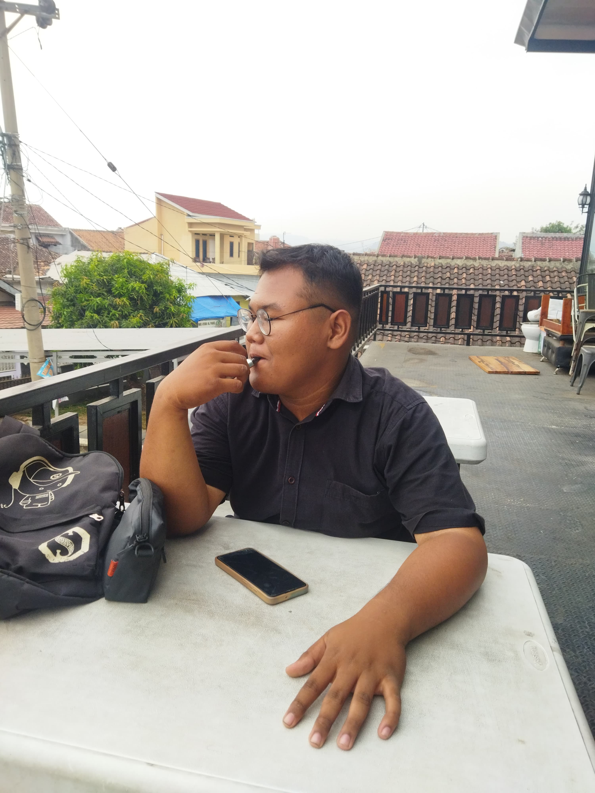

!DOCTYPE html>
<html lang="en">
<head>
    <meta charset="UTF-8">
    <meta name="viewport" content="width=device-width, initial-scale=1.0">
    
    <title>Dynamic Content Website</title>
</head>
<body>

    <!-- Menu Container -->
    

        
&#9776;
 <!-- Ikon Garis Tiga -->
        

            <a href="#" onclick="showSection('home')">Home</a>
            <a href="#" onclick="showSection('about')">About</a>
            <a href="#" onclick="showSection('contact')">Contact</a>
        

    

    
    

        <!-- Home Section -->
        

            <h1>Selamat datang di website saya</h1>
            
            <!-- Tambahan Foto Biodata -->
            
            
<strong>Nama:</strong> Alvito Dikatama

            
<strong>Tanggal Lahir:</strong> 11 Oktober 2004

            
<strong>Alamat:</strong> Jl. Raya Sukoharjo III, Sukoharjo II, Kec. Sukoharjo, Kabupaten Pringsewu, Lampung 35373

            
<strong>NPM:</strong> 2313025006

            
<strong>Kelas:</strong> PTI-23B

            
Di sini saya hanya sebagai pemula yang tidak bisa apa apa namun di sini saya mencoba untuk bisa namun saat ini saya belum bisa apa apa.

        

        <!-- About Section -->
        

            <h2>Bahasa Pemrograman Website</h2>
            <ul>
                
Saya membuat website ini dngan menggunakan beberpa bahasa di antaranya adalah: 

                <li>HTML</li>
                <li>CSS</li>
                <li>JavaScript</li>
                
pengalaman saya

                  <li>saya sudah mempelajari beberapa bahasa pemrograman di antaranya seperti yang sudah saya gunakan pada program ini</li>
            </ul>
        

        <!-- Contact Section -->
        

            <h2>Kontak:</h2>
            
Gmail: alvitodika2202@gmail.com

            
WA: 087718516491

            <!-- Tambahan Media Sosial -->
            

                <a href="https://www.instagram.com/tama6415/profilecard/?igsh=MTRtOGV5YmhhN2loMg==" target="_blank">Instagram</a>
                <a href="https://www.facebook.com/profile.php?id=100016070436215" target="_blank">Facebook</a>
            

        

    

</body>
</html>

